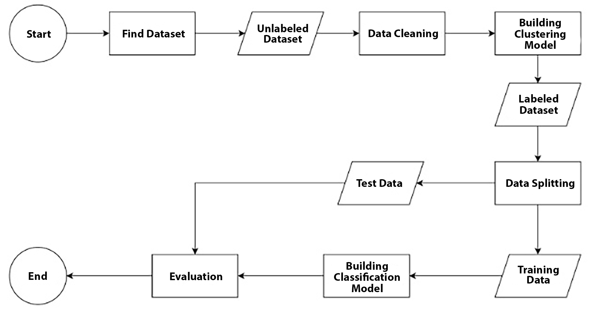

# Clustering and Classification Analysis for Istanbul Retail Sales

## Project Overview

This project implements a two-stage machine learning approach combining unsupervised clustering and supervised classification. The analysis was conducted using provided templates and follows specific criteria for both stages as part of the Dicoding Data Science Bootcamp (January 2025).

## Dataset Information

The analysis uses the "[Customer Shopping Dataset - Retail Sales Data](https://www.kaggle.com/datasets/mehmettahiraslan/customer-shopping-dataset)" from Kaggle, which contains shopping information from 10 different shopping malls in Istanbul between 2021 and 2023.

### Dataset Features:

*   `invoice_no`: Unique identifier for each transaction (Format: 'I' + 6-digit integer)
*   `customer_id`: Unique identifier for each customer (Format: 'C' + 6-digit integer)
*   `gender`: Customer's gender
*   `age`: Customer's age
*   `category`: Product category
*   `quantity`: Number of items purchased
*   `price`: Unit price in Turkish Liras (TL)
*   `payment_method`: Payment type (cash, credit card, or debit card)
*   `invoice_date`: Transaction date
*   `shopping_mall`: Location of the transaction

## Project Structure

*   `clustering.ipynb`: Notebook for clustering analysis in Bahasa Indonesia
*   `classification.ipynb`: Notebook for classification analysis in Bahasa Indonesia

### Update: English Version Available

*   `clustering_en.ipynb`: English version of the clustering analysis notebook
*   `classification_en.ipynb`: English version of the classification analysis notebook

## Requirements & Criteria

### Clustering Stage

1.  **Dataset Requirements**

    Minimum two columns:
    - One categorical column
    - One numerical column
    This combination enables meaningful cluster formation

2.  **Performance Metrics**

    - Achieved Silhouette Score: ≥ 0.55
    - This score indicates well-formed clusters with good separation

3.  **Cluster Interpretation**

    - Detailed analysis of cluster characteristics
    - Data distribution within clusters
    - Insights derived from clustering results

### Classification Stage

1.  **Dataset**
    - Uses labeled data from clustering results
    - Labels from clustering serve as classification targets

2.  **Model Performance**
    - Minimum accuracy: 87% (both training and testing sets)
    - Minimum F1-Score: 87% (both training and testing sets)

## Dependencies

    - Python 3.x
    - Refer to the requirements.txt file for all required libraries.

## Project Status

✅ Completed

    - Successfully implemented clustering analysis
    - Achieved required Silhouette Score
    - Completed classification with required accuracy metrics
    - Detailed interpretations for project results
    - Recommendation for future submission criteria provided

## License

This project is developed as part of my submission for the Dicoding Indonesia Data Science Bootcamp Batch 4 (2024).

If you find this project helpful or have ideas for improvements, I’d love to hear from you! Thank you :)
